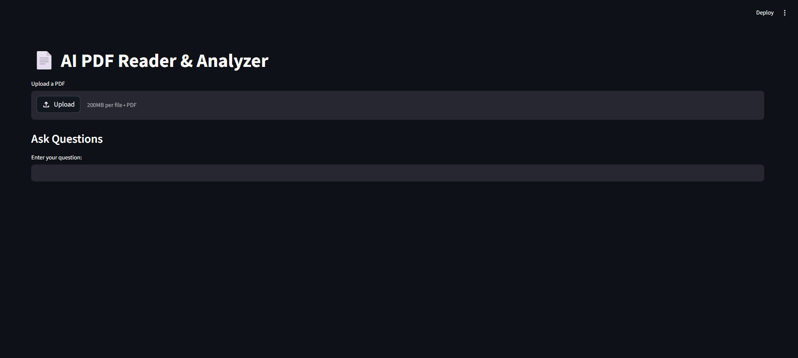
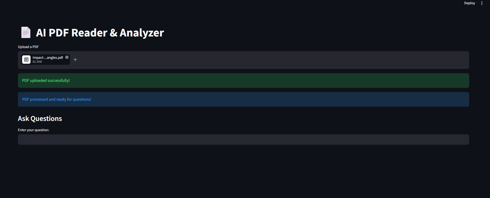
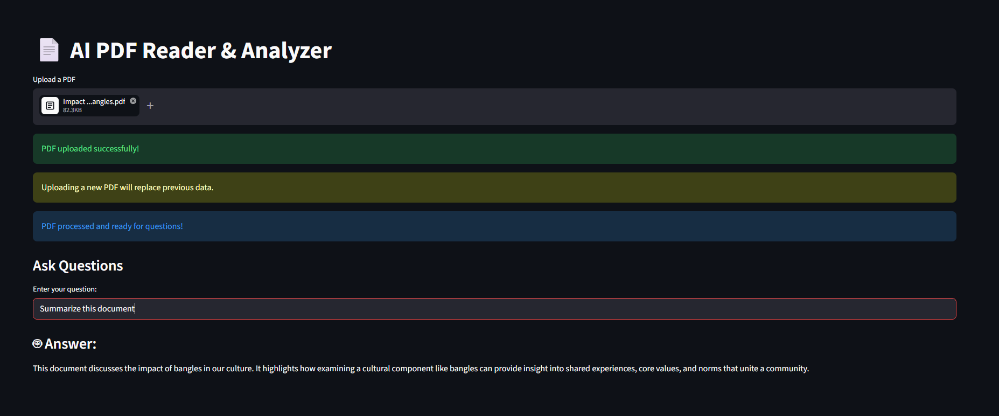
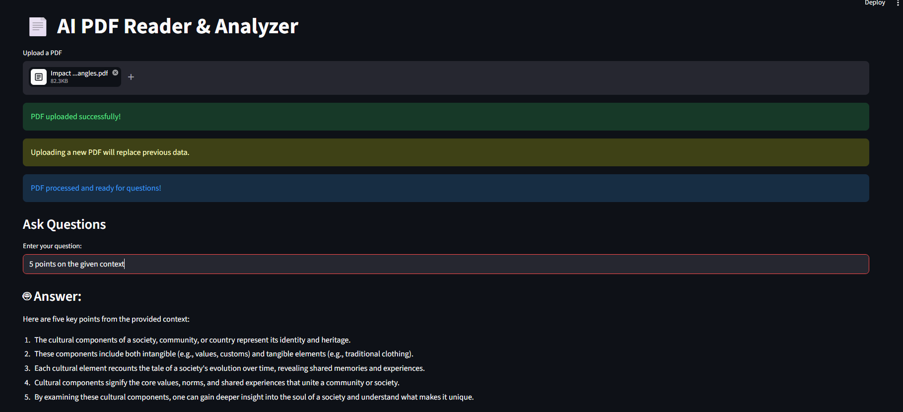

# AI PDF Reader & Analyzer (Local, Free, Offline)

A fully local AI agent that can read, understand, and answer questions from PDF documents using Retrieval-Augmented Generation (RAG).

Built with **LangChain + Ollama + ChromaDB + Streamlit**, this project runs entirely offline with no paid APIs.

---

## Features

* Upload and process PDF documents
* Automatic text chunking for better understanding
* Semantic search using embeddings
* Context-aware question answering (RAG pipeline)
* Interactive chat interface (Streamlit)
* Fully local — no internet or API keys required

---

## How It Works

This project implements a **Retrieval-Augmented Generation (RAG)** pipeline:

1. Load PDF → extract text
2. Split text into manageable chunks
3. Convert chunks into embeddings
4. Store embeddings in ChromaDB
5. User asks a question
6. Retrieve relevant chunks
7. Send context + question to LLM (Ollama)
8. Generate accurate answer

---

## Tech Stack

| Component       | Tool                   |
| --------------- | ---------------------- |
| LLM             | Ollama (LLaMA3)        |
| Framework       | LangChain              |
| Vector Database | ChromaDB               |
| Embeddings      | Sentence Transformers  |
| UI              | Streamlit              |
| Language        | Python                 |

---

## Project Structure

```
pdf_agent/
│── README/            # All about the project
│── data/              # PDF files
│── db/                # Chroma vector database
│── pdf_loader.py      # Load + split PDF
│── vector_store.py    # Create embeddings + store
│── qa_agent.py        # Retrieval + LLM logic
│── app.py             # Streamlit UI
│── test_ollama.py     # LLM test
```

---

## Installation & Setup

### 1. Clone repository

```
git clone: [https://github.com/Adunc64/AI-PDF-Reader]
cd pdf_agent
```

### 2. Create virtual environment

```
python -m venv venv
venv\Scripts\activate   # Windows
```

### 3. Install dependencies

```
pip install langchain langchain-community langchain-core chromadb pypdf sentence-transformers streamlit ollama
```

### 4. Install Ollama

Download: [https://ollama.com]

Run model:

```
ollama run llama3
```

---

## Run the App

```
streamlit run app.py
```

---

## Example Usage

* Upload a pdf (PDF)
* Ask:

  * "Summarize this document"
  * "What are the key findings?"
  * "Explain methodology"

---

## Example Output

> **Question:** What is the main topic of the paper?
> **Answer:** The paper discusses ...

---

## ⚠️ Limitations

* Single PDF at a time
* No OCR for scanned PDFs
* Processing can be slow on low-end machines

---

## Future Improvements

* Multi-PDF support
* Chat history (memory)
* Source highlighting
* OCR for scanned documents
* Advanced agent tools

---

## Screenshots

**UI:**


**PDF uploaded and embedded**


**question and answer**



---

## 👤 Author

Raheek Raiyan

GitHub: [https://github.com/Adunc64]
